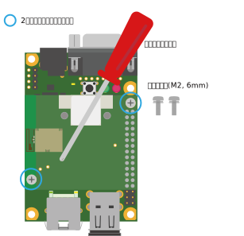

# Deguゲートウェイ A6

[アットマークテクノ製 Deguゲートウェイ A6](https://armadillo.atmark-techno.com/degu-a6) は、[Armadillo-640](https://armadillo.atmark-techno.com/armadillo-640)をベースに、専用のソフトウェアパッケージとArmadillo-600シリーズThreadオプションモジュールを搭載したDeguゲートウェイです。

## 外観


|番号|名称                          |説明                                                              |
|----|------------------------------|------------------------------------------------------------------|
|1   |USBコネクタ                   |USBメモリ等を接続します(※蓋をされている上段は使用できません)     |
|2   |LANコネクタ                   |LANケーブルを接続します                                           |
|3   |LANリンクアクティビティLED(黄)|LANポートが使用可能な時に点灯し、データが送受信されると点滅します |
|4   |LANスピードLED(緑)            |100Mbpsで接続されていると点灯し、ケーブルが未接続だと消灯します   |
|5   |ユーザーLED(赤)               |ユーザーで自由に機能を設定できるLEDです                           |
|6   |ユーザーLED(緑)               |ユーザーで自由に機能を設定できるLEDです                           |
|7   |ユーザースイッチ              |ユーザーで自由に機能を設定できるスイッチです                      |
|8   |シリアルコネクタ              |シリアルクロスケーブルを接続します                                |
|9   |電源コネクタ                  |付属のACアダプタを接続します                                      |


## 接続方法
Deguゲートウェイ A6と周辺装置の接続例を次に示します。


## Armadillo-640 製品マニュアルの適用範囲

有線 LAN の使用方法など、Armadillo-640との差分が無い箇所については、[Armadillo-640 製品マニュアル](https://users.atmark-techno.com/armadillo-640/manual)の内容が適用できます。

Deguゲートウェイ A6から見たArmadillo-640との差分は次の通りです。

* Armadillo-600シリーズThreadオプションモジュールを搭載しています
* CON1(SDインターフェース)は[復旧手順](#seq_recovery)以外に使用できません
* CON3(シリアルインターフェース)をコンソールとして使用します
* CON5(USB ホストインターフェース)の上段が使用できません
* インストールディスクとしてUSBメモリを使用します
* 次のイメージファイルが異なります
  * インストールディスクイメージ
  * ブートローダー
  * DTB (Device Tree Blob)
  * ルートファイルシステム


## <a name="seq_install">インストール手順</a>

Deguゲートウェイ A6にインストールされている全てのソフトウェアを工場出荷状態に戻す手順を以下に示します。Deguゲートウェイ A6に設定したAWS情報等も全て初期化される点に注意してください。USBメモリは512MB以上の容量が必要です。

1. インストールディスクの作成

    USBメモリがマウントされている場合は事前にアンマウントしてから、USBメモリにインストールディスクイメージを書き込みます。

    ```
    [ATDE]# sudo dd if=install-disk-degugw-a6-[version].img of=/dev/sdx bs=4M conv=fsync
    ```

2. インストールディスクの接続

    Deguゲートウェイ A6の電源が切断されていることを確認し、USBメモリを接続します。

3. インストールの実行

    ユーザースイッチを押しながら電源を投入します。

    次のように "run usbboot" コマンドを実行するとインストールが始まります。


    ```
    => run usbboot
    ```

    次のようにメッセージが表示されるとインストール完了です。電源を切断し、USBメモリを取り外してください。

    ```
    *+*+* Install Completed!! *+*+*
    ```

## <a name="seq_recovery">復旧手順</a>

不測の事態により、Deguゲートウェイ A6のブートローダーを破壊してしまった場合の復旧手順を以下に示します。Deguゲートウェイ A6に設定したAWS情報等も全て初期化されます。SDカードは512MB以上の容量が必要です。

ブートローダーが起動できる場合は、この手順を実行しないでください。ソフトウェアの初期化やアップデートは、[インストール手順](#seq_install)を参照してください。

1. インストールディスクの作成

    SDカードがマウントされている場合は事前にアンマウントしてから、SDカードにインストールディスクイメージを書き込みます。

    ```
    [ATDE]# sudo dd if=install-disk-degugw-a6-[version].img of=/dev/sdx bs=4M conv=fsync
    ```

2. インストールディスクの接続

    Deguゲートウェイ A6の電源が切断されていることを確認し、Deguゲートウェイ A6ケースのネジを外して開けます。

    

    Armadillo-600シリーズThreadオプションモジュールのネジを外します。

    

    Armadillo-600シリーズThreadオプションモジュールを取り外して、SDカードを接続します。

    

    JP1 と JP2 を共にジャンパでショートします。

    

3. インストールの実行

    ユーザースイッチを押しながら電源を投入します。

    次のように "boot" コマンドを実行するとインストールが始まります。


    ```
    => boot
    ```

    次のようにメッセージが表示されるとインストール完了です。

    ```
    *+*+* Install Completed!! *+*+*
    ```

    電源を切断し、次の作業を行います。

    * JP1 と JP2の取り外し
    * SDカードの取り外し
    * Armadillo-600シリーズThreadオプションモジュールの組み立て
    * ケースの組み立て
