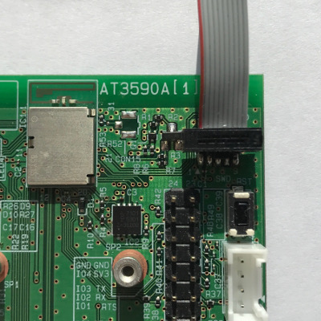
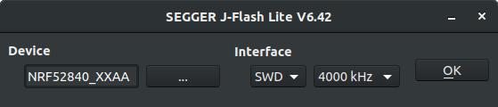
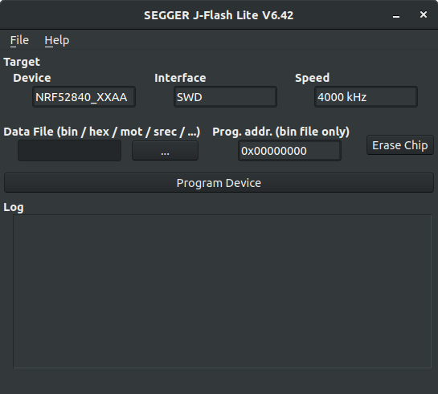
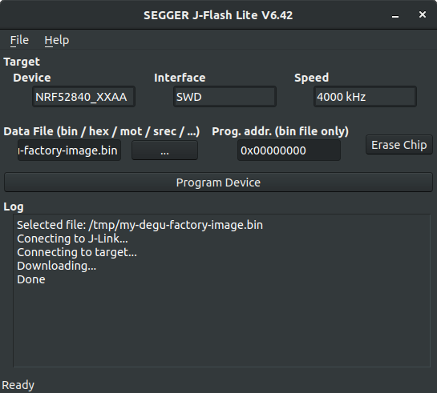

# ファクトリーイメージの利用

Deguファームウェアの書き込みは[`dfu-util`で行うことができます](../user_manual/20_software_update.md)が、実際のDeguのFlash上にはDeguファームウェアだけではなく、MCUboot(ブートローダー)や、MicroPythonコードを格納するファイルシステム等が[書き込まれています。](flash_memory_map.md)

これら全てを1つにまとめたイメージファイルを、ファクトリーイメージと呼んでいます。ファクトリーイメージは、デバッガを使ってFlashの先頭から書き込むことができるため、工場出荷に利用することができます。

## 準備

以下のものを用意してください。

* PC
* Degu
* SEGGER J-Link等、nRF52840に対応するデバッガ
* MCUbootバイナリ
  * ここでは、`mcuboot.bin`とします。[こちら](https://github.com/open-degu/mcuboot/releases)から最新の標準イメージをダウンロードできます。
* Deguファームウェア
  * ここでは、`degu.bin`とします。 [こちら](https://github.com/open-degu/degu/releases)から最新の標準イメージをダウンロードできます。

ここでは、[SEGGER J-Link](https://www.segger.com/products/debug-probes/j-link/)を使って説明します。

## ファクトリーイメージの作成

1. deguレポジトリをダウンロードする

    ```
    $ git clone https://github.com/open-degu/degu.git
    $ cd degu
    ```

1. ファクトリーイメージを作成する

    `make-factory-image.sh`スクリプトを使って、ファクトリーイメージを作成することができます。ここでは、作成するファクトリーイメージ名を`my-degu-facotry-image.bin`とします。

    ```
    $ ./make-factory-image.sh mcuboot.bin degu.bin my-degu-facotry-image.bin
    ```

    これで、ファクトリーイメージの作成が完了しました。

## ファクトリーイメージの書き込み

J-Linkを使って、ファクトリーイメージを書き込む手順を紹介します。

1. J-Link Software and Documentation Packをインストールする

    各PCのOSに対応した[J-Link Software and Documentation Pack](https://www.segger.com/downloads/jlink/#J-LinkSoftwareAndDocumentationPack)をダウンロードし、インストールしてください。

1. J-LinkとMicroUSBケーブルを接続する

    PCにJ-LinkとMicroUSBケーブルを接続してください。

1. SWDコネクタにJ-Linkを接続する

    次の図のように、DeguのSWDコネクタにJ-LinkのSWDケーブルを接続してください。

    

1. Deguの電源を入れる

    PCに接続したMicroUSBケーブルをDeguに接続し、電源を入れてください。

1. JFlashを起動する

    PCでJFlashを起動してください。起動すると、ターゲットデバイスの種類とインターフェースを選択できるので、次のように設定し、`OK`をクリックしてください。

    * `Device`
      * `NRF52840_XXAA`を選択
    * `Interface`
      * `SWD`, `4000kHz`を選択

    

1. ファクトリーイメージを書き込む

    `Data File` に、作成したファクトリーイメージ(ここでは`my-degu-facotry-image.bin`)を指定してください。`Prog.addr.`は、`0x00000000`のまま変更しないでください。

    

    `Program Device`をクリックすると、書き込みが開始します。書き込みが完了すると、`Log`に`Done`と表示されます。

    

    これで、ファクトリーイメージの書き込みが完了しました。Deguは自動的にリセットし、書き込んだファームウェアが起動します。
