# Deguゲートウェイのセットアップ

Deguゲートウェイをセットアップし、これにDeguを接続する手順を示します。

## AWSの設定

この手順は、既に **AWSのアカウントを作成し、AWSマネジメントコンソールにログインできていること** を前提としています。AWSアカウントの作成方法については、 https://aws.amazon.com/jp/register-flow/ を参照してください。

## IAMユーザー作成

AWSマネジメントコンソールへログインし、サービス一覧から**IAM**を選択してください。その後、ユーザータブを開き、「ユーザーを追加」をクリックします。

### ユーザーを追加
下記の通り入力、選択し「次のステップ: アクセス権限」に進みます。

* ユーザー名
* AWSアクセスの種類を**両方**選択
* コンソールのパスワードは**自動生成パスワード**を選択
* 「パスワードのリセットが必要」に**チェック**を入れる

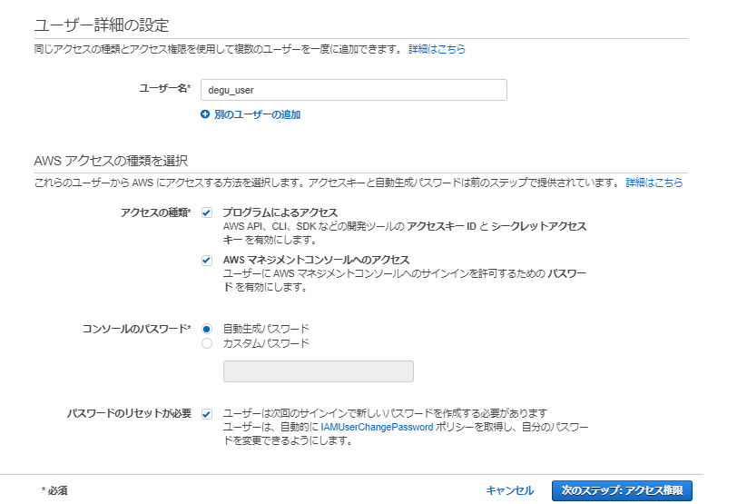

### アクセス許可の設定
下記の手順でポリシーをアタッチし、「次のステップ: アクセス権限」に進みます。

* 「既存のポリシーを直接アタッチ」を選択
* ポリシーのフィルタに**AWSIoTConfigAccess**と入力
* 表示された**AWSIoTConfigAccess**にチェック

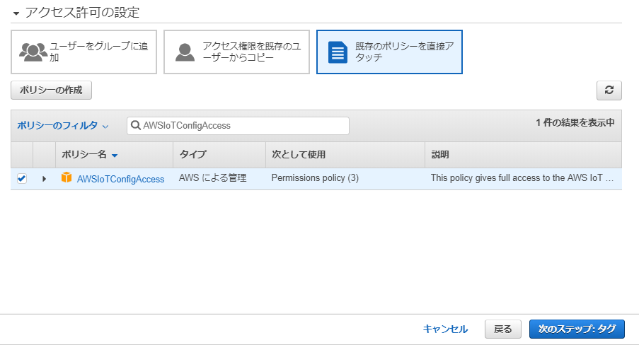

### タグの追加(オプション)
今回は設定不要です。「次のステップ: 確認」に進みます。
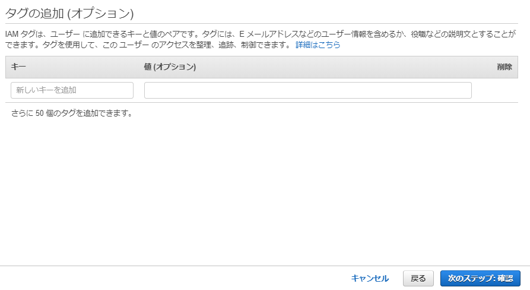

### 確認画面
確認画面が表示されます。設定した通りの内容になっていることを確認し、「ユーザーの作成」をクリックしてください。
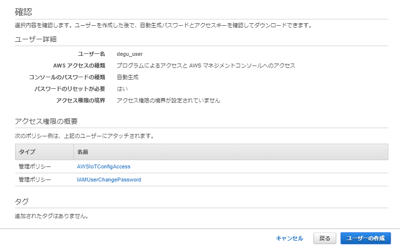

### IAMユーザー作成完了
成功すると下記のような画面が表示されます。  
後ほどDeguゲートウェイの設定で使用するため、ここでは必ず**csvのダウンロード**を忘れずに行ってください。
行わなかった場合、再度IAMユーザーを作成する必要があります。  
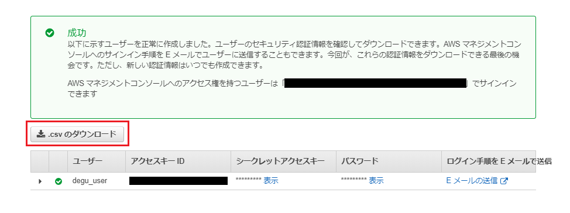

## Deguゲートウェイの設定

    Deguゲートウェイの操作方法や設定ファイルの編集方法については、各製品のマニュアルを参照してください。

### rootのパスワードの変更

Deguゲートウェイの設定は、スーパーユーザーで実行します。  
初期パスワードのままだとセキュリティリスクが高まるため、必ず初期パスワードを変更してください。

```
# passwd
Enter new UNIX password: # 新しいパスワードを入力
Retype new UNIX password: # 再入力
```

### AWS情報設定ファイルの編集

1. 設定ファイル `mqttinfo.json` をテキストエディタで開きます。

```
# vi /etc/coap-mqtt/mqttinfo.json
```

* mqttinfo.json <デフォルト>

  ```
    {
      "key" : "/etc/coap-mqtt/private.pem.key",
      "cert" : "/etc/coap-mqtt/certificate.pem.crt",
      "cafile" : "/etc/coap-mqtt/RootCA.crt",
      "aws_endpoint" : "",
      "secretaccesskey" : "",
      "accesskeyid" : "",
      "region" : ""
    }
    ```

    4つの項目を編集します。
    * aws_endpoint
    * secretaccesskey
    * accesskeyid
    * region

#### aws_endpoint
IoT Coreのエンドポイントを指定します。  
AWSマネジメントコンソールへログインし、サービス一覧から**IoT Core**を選択してください。  
「設定」タブを開き、カスタムエンドポイントに表示されているエンドポイントをコピー、下記の通り修正します。

* エンドポイントが `xxxxx.iot.ap-northeast-1.amazonaws.com` の場合
```
  "aws_endpoint" : "xxxxx.iot.ap-northeast-1.amazonaws.com",
```

#### secretaccesskey
シークレットアクセスキーを指定します。  
IAMユーザー作成時にダウンロードしたcsvファイルに記載されています。

* Secret access keyが `asdfghjkl` の場合
```
  "secretaccesskey" : "asdfghjkl",
```

#### accesskeyid
アクセスキーIDを指定します。  
IAMユーザー作成時にダウンロードしたcsvファイルに記載されています。

*   Access key IDが AWS123 の場合
```
  "accesskeyid" : "AWS123",
```

#### region
リージョンを指定します。  
エンドポイントから取得できます。

* エンドポイントが xxxxx.iot.ap-northeast-1.amazonaws.com の場合
```
  "region" : "ap-northeast-1"
```

#### mqttinfo.json <編集後>

```
{
  "key" : "/etc/coap-mqtt/private.pem.key",
  "cert" : "/etc/coap-mqtt/certificate.pem.crt",
  "cafile" : "/etc/coap-mqtt/RootCA.crt",
  "aws_endpoint" : "xxxxx.iot.ap-northeast-1.amazonaws.com",
  "secretaccesskey" : "asdfghjkl",
  "accesskeyid" : "AWS123",
  "region" : "ap-northeast-1"
}
```

### アクセスポイント情報を変更する
Deguゲートウェイは各Deguを接続するために無線LANアクセスポイントとして動作します。デフォルトでは、次のSSIDとパスフレーズが設定されています。  

  | SSID | パスフレーズ |
  |:-----------|:------------|
  | MyAccessPoint | 12345678 |

デフォルトの設定のままで運用すると、パスフレーズを把握している誰もがアクセスできてしまいます。必ずアクセスポイント情報を任意のものに再設定してください。

#### アクセスポイント設定ファイルの編集
1. 設定ファイル `create_ap.conf` をテキストエディターで開いてください。

    ```
    # vi /etc/create_ap.conf
    ```

1. `create_ap.conf`を編集してください。

    * /etc/create_ap.conf

    ```
    CHANNEL=default
    GATEWAY=10.0.0.1
    WPA_VERSION=2
    ETC_HOSTS=0
    DHCP_DNS=gateway
    NO_DNS=0
    NO_DNSMASQ=0
    HIDDEN=0
    MAC_FILTER=0
    MAC_FILTER_ACCEPT=/etc/hostapd/hostapd.accept
    ISOLATE_CLIENTS=0
    SHARE_METHOD=nat
    IEEE80211N=0
    IEEE80211AC=0
    HT_CAPAB=[HT40+]
    VHT_CAPAB=
    DRIVER=nl80211
    NO_VIRT=0
    COUNTRY=
    FREQ_BAND=2.4
    NEW_MACADDR=
    DAEMONIZE=0
    NO_HAVEGED=0
    WIFI_IFACE=wlan0
    INTERNET_IFACE=eth0
    SSID=MyAccessPoint
    PASSPHRASE=12345678
    USE_PSK=0
    ```

    2点の項目を編集します。
    * SSID
    * PASSPHRASE

    SSIDを "DeguGW"、パスフレーズを "degu-pass" とする場合、次のように変更します。

    ```
    SSID=DeguGW
    PASSPHRASE=degu-pass
    ```

1. `create_ap.conf`の編集後、Deguゲートウェイを再起動してください。

    ```
    # reboot
    ```

1. 再起動後、設定したアクセスポイントにスマートフォンやPCで接続できることを確認します。

### DeguをAWS IoT Coreに登録する

Deguゲートウェイに無線LANで接続したスマートフォンやPCを使って、Deguの登録を行うことができます。

1. アクセスポイントに接続後、Webブラウザで `http://10.0.0.1/degu/` にアクセスすると、次のようなページが表示されます。

    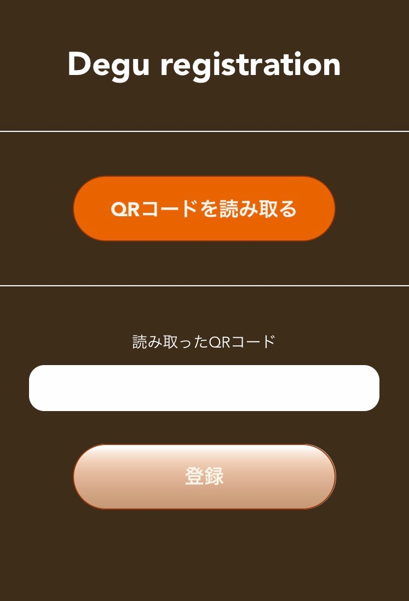

    アクセスできない場合は次の項目を確認してください。
    * アクセスポイントが正しく設定されているか
    * 異なるアクセスポイントに接続していないか

1. DeguのMACアドレスを登録します。

    MACアドレスを登録するには2つの方法があります。

    * QRコードを読み取る
    * MACアドレスを直接入力する

#### QRコードを読み取る

1. `QRコードを読み取る` ボタンをタップすると、カメラが起動します。もし、カメラへのアクセスが許可されていない場合はアクセス許可の設定を行ってください。
PCで接続した場合は、ファイル選択画面が表示されます。このときは、QRコードを撮影した画像をアップロードしてください。

1. Degu本体ケース裏面のQRコードをカメラで撮影します。

    QRコードが小さいと読み込みを行うことができないため、拡大して撮影してください。読み取れない場合は下記のエラーが表示されます。

    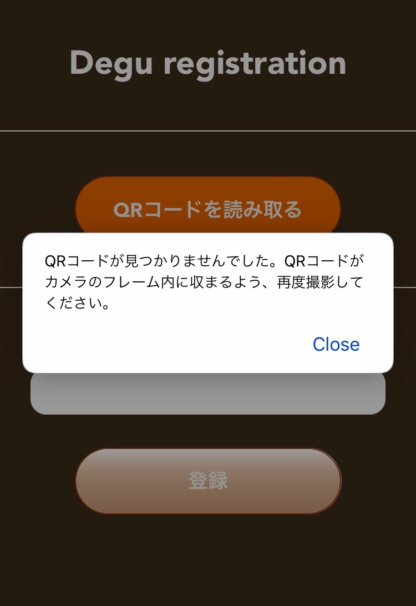

1. 正しく読み込めた場合、`読み取ったQRコード`にMACアドレスが表示されます。表示されている内容がQRコードの左側に記載されている12桁の英数字と一致しているか確認し、`登録`をタップしてください。なお、QRコードの読み込みが失敗した状態(`読み取ったQRコード`が空欄)で`登録`をタップすると、`No mac address`と表示されます。このときは、再度QRコードの読み込みを行ってください。

    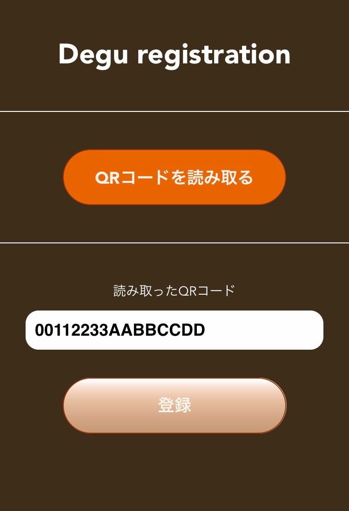

#### MACアドレスを直接入力する

1. `読み取ったQRコード`の下の欄は、直接MACアドレスを入力することができます。この時、アルファベットは**大文字**で入力してください。空欄の状態で`登録`をタップすると`No mac address`と表示されます。このときは、再度入力を行ってください。なお、入力したMACアドレスの正当性確認は行っておりません。誤った内容で`登録`をタップすると入力した内容のままAWS IoTに登録されてしまい、AWS IoT上での削除操作等が必要になるためご注意ください。

1. `登録`をタップ後、`読み取ったQRコード`の下の欄が空欄になったら登録完了です。AWS IoT Coreの「モノ」に、現在登録したDeguのMACアドレスがデバイスとして登録されていることを確認してください。

    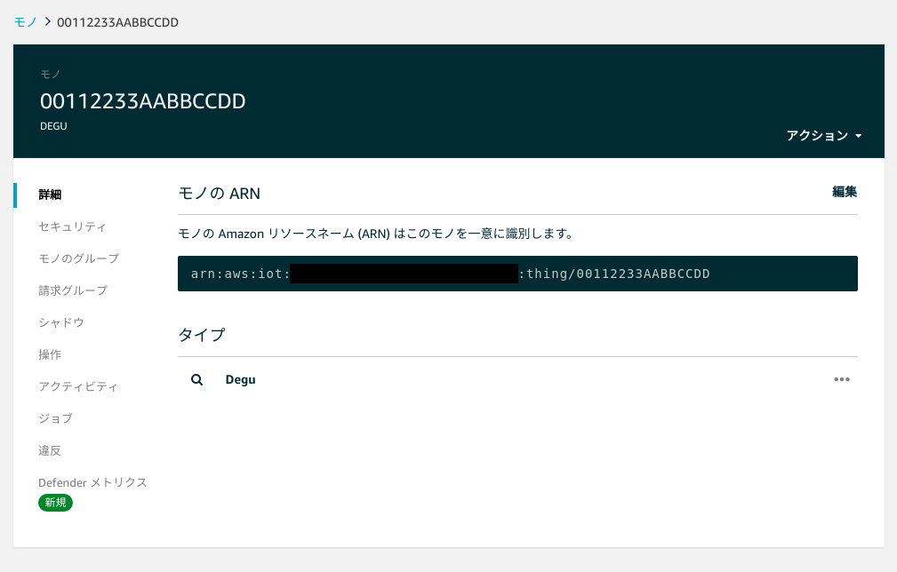

    次の場合は、AWS IoTに登録されたデバイスを削除し、再度デバイスの登録作業を行ってください。
    * アルファベットの大文字・小文字両方のデバイス名が登録されている
    * MACアドレスと異なる名前で登録されている

    デバイスを削除するには、登録されているモノのページで、`アクション`->`削除` をクリックしてください。
    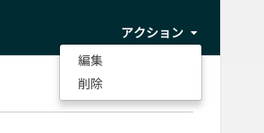

### DeguをDeguゲートウェイへ接続する

1. DeguをAWS IoT Coreに登録してから、5分以内にDeguの電源を入れてください。既にDeguの電源が入っていた場合は、再度電源を入れ直してください。

1. 数十秒後、DeguとDeguゲートウェイとの接続が確立します。接続が確立すると、DeguのLED1が点灯します。

1. Deguゲートウェイが正しくインターネットに接続されている場合、Deguが送信したJSONメッセージが、AWS IoT Core上のモノのシャドウに反映されます。

    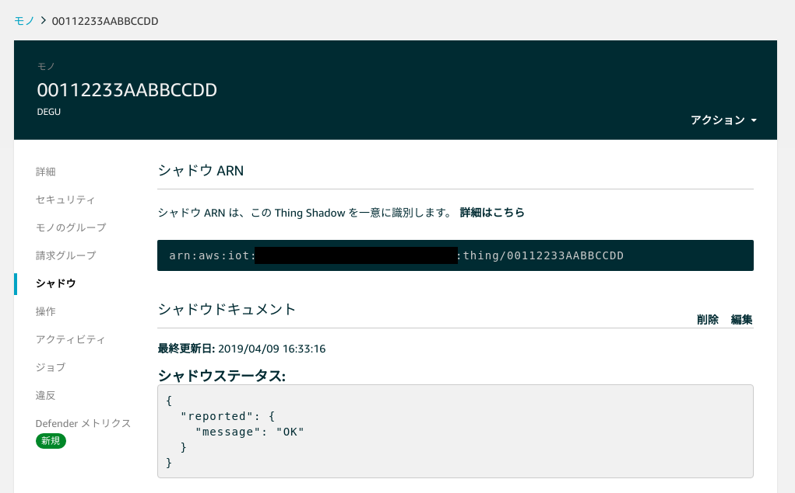
