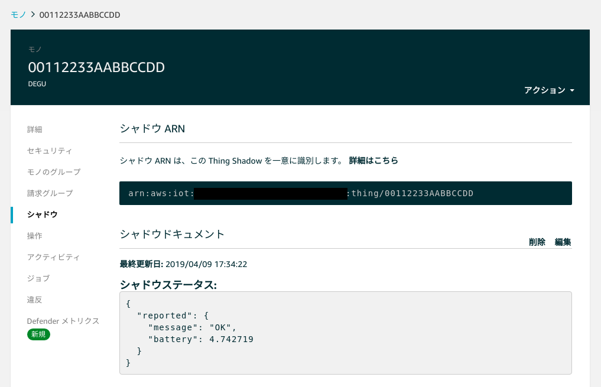

# MicroPythonコードの変更

DeguをMicroUSBケーブルでPCに接続すると、PC上では32KBのUSBマスストレージとして認識されます。

このマスストレージの先頭から16KB分はFAT12形式でフォーマットされており、デフォルトでは以下のファイルが格納されています。

* `main.py`
  * Degu起動後、自動実行されるMicroPythonコード

* `CONFIG`
  * Deguが使用する設定ファイル(現在未定義)

Deguは起動後、自動的に`main.py`を実行します。`main.py`が存在しない場合は、ZephyrのShellを起動し、USBシリアルコンソールに表示します。
`main.py`の内容を任意のMicroPythonコードに書き換えると、電源再投入以降、Deguは変更されたmain.pyを実行します。

例として、1分毎にバッテリー電圧を送信するスクリプトに書き換える手順を示します。

1. Webブラウザで[ここ](https://raw.githubusercontent.com/open-degu/degu-micropython-samples/master/basic/battery/main.py)にアクセスし、Ctrl+S等で`main.py`として保存してください。

1. ダウンロードした`main.py`で、DeguのUSBマスストレージに格納されている`main.py`を上書きしてください。

1. 各OSの正しい手順でPCからDeguを切断してください。
* 注意：DeguのFlashメモリに書き込みが完了するまで時間がかかります。Deguへファイルの書き込みを行う場合、必ず「デバイスの安全な取り外し(※)」を実行し、時間を開けてからDeguを切断して下さい。
     * (※)Windows10の「デバイスの安全な取り外し」手順を以下に示します。
          1. エクスプローラーから「DEGU([ドライブ名])」を右クリック
          2. 「取り外し(J)」をクリック
          3. 「ハードウェアの取り出し "USB Composite Device"をコンピュータから安全に取り外すことができます」というメッセージが表示される事を確認
          4. 5秒程度時間を開ける
          5. Deguをコンピュータから切断

1. Deguの電源を入れ直すと、AWS IoT Coreに登録されたDeguのシャドウに、電源電圧が追加されます。

    
