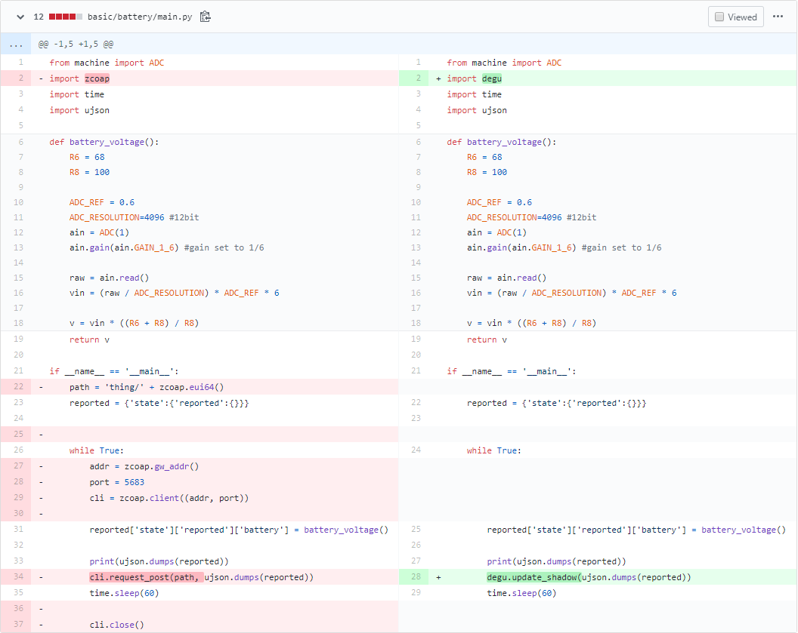

* [概要](#intro)
* [Deguゲートウェイの更新](#update_gw)
* [Deguセンサーの更新](#update_sensor)

# <a name="intro">概要</a>

Deguの新ソフトウェアを2020年1月31日にリリースいたしました。  

Deguゲートウェイ、Deguセンサー(ファームウェア/MicroPythonコード)を新ソフトウェアにアップデートすることにより、次の機能が利用できるようになります。

1. セキュアエレメント(A71CH)に保存された証明書を使用した、AWSからの個体認証(センサー、ゲートウェイ共に個体認証可能)
1. DTLSによるDeguゲートウェイとDeguセンサー間のセキュアな通信
1. Deguセンサーのパワーマネージメント機能に正式対応
1. OTAによるDeguセンサーのリモートファームウェアアップデート機能の正式対応

## 各種ソフトウェアバージョンの互換性に関して

ソフトウェアをアップデートする際は、互換性に注意してください。  
新・旧混ぜた、下記のような組み合わせでは動作できません。  

* Deguセンサー:旧ソフトウェア、Deguゲートウェイ:新ソフトウェア
* Deguセンサー:新ソフトウェア、Deguゲートウェイ:旧ソフトウェア

DeguセンサーとDeguゲートウェイは、以下の旧ソフトウェアバージョンと新ソフトウェアバージョンの組み合わせでのみ動作可能です。

  <table>
    <tr>
      <th colspan="2">項目</th>
      <th>旧ソフトウェア</th>
      <th>新ソフトウェア</th>
    </tr>
    <tr>
      <td colspan="2">ステータス</td>
      <td><b>非サポート</b></td>
      <td>サポート</td>
    </tr>
    <tr>
      <td rowspan="3">Deguセンサー</td>
      <td>degu.bin（MTDファームウェア）</td>
      <td>0.9.5以前</td>
      <td>1.0.0-rc1以降</td>
    </tr>
    <tr>
      <td>MicroPythonサンプルコード</td>
      <td><b>github公開の0.9.5以前の対応コード<br>を利用する必要があります</b></td>
      <td>githubにて公開・継続メンテナンス</td>
    </tr>
    <tr>
      <td>degu_router.bin（FTDファームウェア）</td>
      <td>0.9.5以前</td>
      <td>1.0.0-rc1以降</td>
    </tr>
    <tr>
      <td rowspan="2">Deguゲートウェイ G3</td>
      <td>インストールディスクイメージ</td>
      <td><a href="https://users.atmark-techno.com/files/downloads/armadillo-iot-g3/image/install_disk_sd_20190520_degugw_iotg3_m1.img">install_disk_sd_20190520_degugw_iotg3_m1.img</a></td>
      <td><a href="https://users.atmark-techno.com/files/downloads/armadillo-iot-g3/image/install_disk_sd_20200131_degugw_iotg3_m1.img">install_disk_sd_20200131_degugw_iotg3_m1.img</a></td>
    </tr>
    <tr>
      <td>Debian GNU/Linux 9（Stretch）<br>ユーザーランド</td>
      <td><a href="https://users.atmark-techno.com/files/downloads/armadillo-iot-g3/debian/debian-stretch-armhf_degugw_20190520.tar.gz">debian-stretch-armhf_degugw_20190520.tar.gz</a></td>
      <td><a href="https://users.atmark-techno.com/files/downloads/armadillo-iot-g3/debian/debian-stretch-armhf_degugw_20200131.tar.gz">debian-stretch-armhf_degugw_20200131.tar.gz</a></td>
    </tr>
    <tr>
      <td rowspan="2">Deguゲートウェイ A6</td>
      <td>インストールディスクイメージ</td>
      <td><a href="https://users.atmark-techno.com/files/downloads/armadillo-640/image/install-disk-degugw-a6-20191224.img">install-disk-degugw-a6-20191224.img</a></td>
      <td><a href="https://users.atmark-techno.com/files/downloads/armadillo-640/image/install-disk-degugw-a6-20200131.img">install-disk-degugw-a6-20200131.img</a></td>
    </tr>
    <tr>
      <td>Debian GNU/Linux 9（Stretch）<br>ユーザーランド</td>
      <td><a href="https://users.atmark-techno.com/files/downloads/armadillo-640/debian/debian-stretch-armhf-degugw-a6-20190725.tar.gz">debian-stretch-armhf-degugw-a6-20190725.tar.gz</a></td>
      <td><a href="https://users.atmark-techno.com/files/downloads/armadillo-640/debian/debian-stretch-armhf-degugw-a6-20200131.tar.gz">debian-stretch-armhf-degugw-a6-20200131.tar.gz</a></td>
    </tr>
    <td rowspan="5">Deguゲートウェイ 共通</td>
    <tr>
      <td>coap-mqtt-bridge</td>
      <td>1.1.0以前</td>
      <td>2.0.0-1以降</td>
    </tr>
    <tr>
      <td>degugw-mqtt-client</td>
      <td>------</td>
      <td>2.0.0-1以降 ※新規リリース</td>
    </tr>
    <tr>
      <td>degu-manager</td>
      <td>1.0.3-1</td>
      <td>2.0.0-1以降</td>
    </tr>
    <tr>
      <td>libengine-a71ch-openssl</td>
      <td>------</td>
      <td>1.0.0-1以降 ※新規リリース</td>
    </tr>
  </table>

## 新ソフトウェアのリリースノート

各種パッケージ、ファームウェアのリリースノートについては以下をご確認ください。

* Deguゲートウェイ
    * [Deguゲートウェイ G3](https://armadillo.atmark-techno.com/20200131/software-update-degu-g3)
    * [Deguゲートウェイ A6](https://armadillo.atmark-techno.com/20200131/software-update-degu-a6)
* Deguセンサー  
Deguセンサーファームウェア バイナリのリリースに関しては以下を参照してください。  
https://github.com/open-degu/degu/releases

## 旧ソフトウェアを継続して利用する際の手順

旧ソフトウェアを利用する際の手順を次に示します。

### Deguセンサー

0.9.5以前のイメージを書き込んでください。  
ファームウェアに関しては https://github.com/open-degu/degu/releases からダウンロードしてください。

### Deguゲートウェイ

次のようにコマンドを実行し、 coap-mqtt-bridgeとdegu-managerをバージョン指定でインストールしてください。  
バージョン指定をしないでapt installコマンドを実行すると、新ソフトウェア対応のパッケージが自動的に選択されます。  

```
DeguGW # apt update
DeguGW # apt install degu-manager=1.0.3-1
DeguGW # apt install coap-mqtt-bridge=1.1.0
```


# <a name="update_gw">Deguゲートウェイの更新</a>

以下に、Deguゲートウェイを新ソフトウェアへ移行する手順を示します。

## AWS IoT CoreのモノからDeguゲートウェイを削除

AWS IoT Core上で、Deguゲートウェイのモノを削除してください。  
登録されているモノのページで、`アクション`->`削除`をクリックしてください。  


## CA証明書を作成し、AWS IoT Coreへ登録

Linux PC上で、[Deguゲートウェイのセットアップ](https://open-degu.github.io/user_manual/30_setup/) の『CA証明書の作成、AWS IoT Coreへの登録、Deguゲートウェイへの設置』を参照し、CA証明書の作成とAWS IoT Coreへの登録を行ってください。

## Deguゲートウェイのパッケージを更新

degu-managerを最新バージョンにアップデートします。  
関連するパッケージも更新されます。  

```
DeguGW # apt update
DeguGW # apt install degu-manager
DeguGW # apt install coap-mqtt-bridge
```
Degu v1.0.0-rc1に対応する、Deguゲートウェイ側Debianパッケージのバージョンは以下の通りです。

| パッケージ名 | パッケージバージョン |
----|----
| degu-manager | 2.0.0-1 |
| coap-mqtt-bridge | 2.0.0-1 |
| degugw-mqtt-client | 2.0.0-1 |
| ibengine-a71ch-openssl | 1.0.0-1 |

パッケージcoap-mqtt-bridgeを更新する際、以下のようなメッセージが表示されることがあります。
```
configuration file '/etc/coap-mqtt/mqttinfo.json'
 ==> Modified (by you or by a script) since installation.
 ==> Package distributor has shipped an updated version.
   What would you like to do about it ?  Your options are:
    Y or I  : install the package maintainer's version
    N or O  : keep your currently-installed version
      D     : show the differences between the versions
      Z     : start a shell to examine the situation
 The default action is to keep your current version.
*** mqttinfo.json (Y/I/N/O/D/Z) [default=N] ?

```
このメッセージが表示された場合、一旦`D`を押し差分を表示します。  
更新前の設定ファイルの以下の内容を別な場所に控えておいてください。
```
"aws_endpoint" : "my_endpoint",
"secretaccesskey" : "my_accesskey",
"accesskeyid" : "my_accesskeyid",
"region" : "my_region",
```

控えた上で、`Y`を押して設定ファイルを更新してください。

## CA証明書とキーペアをDeguゲートウェイに設置

[Deguゲートウェイのセットアップ](https://open-degu.github.io/user_manual/30_setup/) の『CA証明書をDeguゲートウェイへコピー』を参照し、`CA証明書を作成し、AWS IoT Coreへ登録`で作成したCA証明書とキーペアを、Deguゲートウェイに設置してください。

## AWS情報設定ファイルの編集

[Deguゲートウェイのセットアップ](https://open-degu.github.io/user_manual/30_setup/) 『AWS情報設定ファイルの編集』を参照し、AWS情報設定ファイルを編集してください。 
`Deguゲートウェイのパッケージを更新`で控えた各項目の値はここで使用します。

## Degu ゲートウェイをAWS IoT Coreへ再登録

[Deguゲートウェイのセットアップ](https://open-degu.github.io/user_manual/30_setup/) の『DeguゲートウェイをAWS IoTへ登録』を参照し、DeguゲートウェイをAWS IoT Coreへ再登録してください。


# <a name="update_sensor">Deguセンサーの更新</a>

以下に、Deguセンサーを新ソフトウェアへ移行する手順を示します。

## ネットワーク情報のクリアとAWS IoT Coreへの再登録

[AWS IoT Coreのシャドウが更新されない](https://open-degu.github.io/trouble_shooting#not_update_shadow)を参照し、Deguセンサー内のネットワーク情報をクリアし、AWS IoT Coreへ再登録してください。

## Deguセンサーファームウェアの更新

[最新の状態へのアップデート](https://open-degu.github.io/user_manual/20_software_update/)の手順を参照し、Deguセンサーファームウェアを最新にしてください。
v1.0.0-rc1のファームウェアは、https://github.com/open-degu/degu/releases/tag/v1.0.0-rc1 に存在します。

## main.py更新

### サンプルコードをそのまま使用している場合

[サンプルコード](https://github.com/open-degu/degu-micropython-samples) から最新のサンプルコードをダウンロードし、Deguセンサーに適用してください。

### 独自のmain.pyをご利用の場合

おおまかな変更方針は以下の通りです。

* import zcoapの箇所をimport deguに置き換えてください。
* cli.request_post()をdegu.update_shadow()に置き換えてください。
* ポート番号の指定など細かい指定が不要となります。

例として、バッテリー残量センサーの差分は以下の通りです。


### main.pyの適用方法

[MicroPythonコードの変更](https://open-degu.github.io/user_manual/40_update_user_script/)を参照し、Deguセンサーに新しいmain.pyを上書きしてください。
